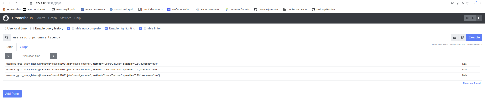

## Example Observable (logs, metrics, and trace) gRPC Application using Opentelemetry 

Demo for patterns to instrument command-line applications, HTTP clients and servers, and gRPC applications. Implemented
structured and levelled logging using [zerolog](https://github.com/rs/zerolog), export measurements from your applications in the statsd format using [datadog-go](https://github.com/DataDog/datadog-go). 
Finally export traces using [opentelemetry-go](https://github.com/open-telemetry/opentelemetry-go) to correlate transactions across system boundaries.

### Instructions for building and running using Docker.

### Pre-requisites

### Install Go 
```
$ wget https://go.dev/dl/go1.18.4.linux-amd64.tar.gz
$ sudo rm -rf /usr/local/go && sudo tar -C /usr/local -xzf go1.18.4.linux-amd64.tar.gz

$ grep GO ~/.bashrc 
export GOROOT=/usr/local/go
export PATH=${GOROOT}/bin:${PATH}
export GOPATH=$HOME/go
export PATH=${GOPATH}/bin:${PATH}

$ go version
go version go1.18.4 linux/amd64
```

### Compiling the proto files (gRPC):

Install protoc binary:
```
$ curl -LO $PB_REL/download/v3.15.8/protoc-3.15.8-linux-x86_64.zip
$ unzip protoc-3.15.8-linux-x86_64.zip -d $HOME/.local
$ export PATH="$PATH:$HOME/.local/bin"
$ protoc --version
libprotoc 3.15.8
```
Install the protocol compiler plugins for Go using the following commands (Ref: https://grpc.io/docs/languages/go/quickstart/):

```
$ go install google.golang.org/protobuf/cmd/protoc-gen-go@v1.28
$ go install google.golang.org/grpc/cmd/protoc-gen-go-grpc@v1.2
```
Fist we need to compile all files that will define our grpc protocol, all coded in the file  grpc-server/service with the following command:

```
$ cd grpc-server/service
$ ./gen_protobufs.sh
```

## Build the docker images

Command line application (`davarski/pkgcli`)

```
$ cd command-line-app

$ ./build-docker-image.sh

$ docker push davarski/pkgcli

```

HTTP server (`davarski/pkgserver`)

```
$ cd http-server

$ ./build-docker-image.sh

$ docker push davarski/pkgserver
```

gRPC server: (`davarski/users-svc`)

```
$ cd grpc-server

$ ./build-docker-image.sh

$ docker push davarski/users-svc
```


### statsd, prometheus and jaeger

Instead of running the statsd server originally created by [etsy](https://github.com/statsd/statsd), we will run [statsd_exporter](https://github.com/prometheus/statsd_exporter). The key reason we do so, i.e. preferring the second option is that 
it allows us to view the metrics via [prometheus web UI](https://prometheus.io). 

We will also start a container running [jaeger](https://www.jaegertracing.io/) as our
distributed tracing server.

### Running them all

The [docker-compose.yml](./docker-compose.yml) runs containers to run the above servers, along with running a MySQL
server, a MinIO container as well as the HTTP and gRPC servers using the images you built above

Run `docker-compose up` (or `docker compose up`):

```
$ docker-compose up -d
Creating go-grpc-app-opentelemetry-example_minio_1     ... done
Creating go-grpc-app-opentelemetry-example_jaeger_1    ... done
Creating prometheus                                    ... done
Creating go-grpc-app-opentelemetry-example_users-svc_1 ... done
Creating go-grpc-app-opentelemetry-example_pkgserver_1 ... done
Creating statsd                                        ... done
Creating go-grpc-app-opentelemetry-example_mysql_1     ... done
```

After a few minutes where docker images will be downloaded if this is the first time you are running, you will have 
seven containers running. Verify that by running `docker ps` from a new command line terminal window:

```
$ docker ps --format '{{.Names}}'
$ docker-compose ps
                    Name                                   Command                  State                                                                                                      Ports                                                                                                
----------------------------------------------------------------------------------------------------------------------------------------------------------------------------------------------------------------------------------------------------------------------------------------------------
go-grpc-app-opentelemetry-example_jaeger_1      /go/bin/all-in-one-linux         Up             0.0.0.0:14250->14250/tcp, 0.0.0.0:14268->14268/tcp, 0.0.0.0:16686->16686/tcp, 0.0.0.0:5775->5775/udp, 0.0.0.0:5778->5778/tcp, 0.0.0.0:6831->6831/udp, 0.0.0.0:6832->6832/udp, 0.0.0.0:9411->9411/tcp
go-grpc-app-opentelemetry-example_minio_1       /usr/bin/docker-entrypoint ...   Up             0.0.0.0:9000->9000/tcp, 0.0.0.0:9001->9001/tcp                                                                                                                                                      
go-grpc-app-opentelemetry-example_mysql_1       docker-entrypoint.sh --def ...   Up             3306/tcp, 33060/tcp                                                                                                                                                                                 
go-grpc-app-opentelemetry-example_pkgserver_1   ./http-server                    Up                                                                                                                                                                                                                 
go-grpc-app-opentelemetry-example_users-svc_1   ./grpc-server                    Up                                                                                                                                                                                                                 
prometheus                                      /bin/prometheus --config.f ...   Up             0.0.0.0:9090->9090/tcp                                                                                                                                                                              
statsd                                          /bin/statsd_exporter --sta ...   Up (healthy)   0.0.0.0:9102->9102/tcp, 9125/tcp, 0.0.0.0:9125->9125/udp         
```

At any point of time, if you want to view the logs from any of the containers, run `docker logs <container name>`.
For example, to view the logs from the package server:

```
$ docker logs go-grpc-app-opentelemetry-example_pkgserver_1
{"level":"info","version":"0.1","time":"2022-08-22T09:56:47Z","message":"Starting HTTP server"}
```

Create a new bucket, `test-bucket` in MinIO by going to: http://127.0.0.1:9001/buckets
in your browser, logging in with username and password as `admin` and `admin123`
respectively.


Now, vist the URL http://127.0.0.1:9090/targets in your browser, and you should see 
a web page, like this:


The key, is the second endpoint, which tells us that it can read the data from the statsd server correctly. Our Go applications will send metrics to `statsd` and prometheus server will read the data from statsd. We will then, soon learn to view and query the metrics from `prometheus`.

Next, visit the URL http://127.0.0.1:16686/search from your browser - this should show you the Jaeger Web UI:


## Run the Package CLI

We are going to run the package CLI as a container using the docker image we built earlier.

What we will be doing is running the container in the same docker network as the other
containers above, so we specify the network name via the `--network` option.
Hence, as a result, we are able to use the docker compose service name
to communicate with the package server, `pkgserver` as well as
`statsd` and `jaeger` (as you can see in [config.yaml](./command-line-app/config.yml).


```
$ cd command-line-app
$ docker run -v ${PWD}:/data -e X_AUTH_TOKEN=token-123 --network go-grpc-app-opentelemetry-example_default -ti davarski/pkgcli register -name "test" -version 0.7 -path /data/main.go http://pkgserver:8080
{"level":"info","version":"0.1","command":"register","time":"2022-08-22T10:14:42Z","message":"Uploading package..."}
Package uploaded: 2/test-0.7-/data/main.go

```


### Viewing the distributed traces

Now, go to the Jaeger Web UI: http://127.0.0.1:16686/search in your browser, select `PkgServer-Cli` from the Service drop down box
on the top left and click on "Find Traces". You should see trace data from your applications.


## Viewing the metrics

Go to the Prometheus Web UI: http://127.0.0.1:9090 and query for metrics.

For the HTTP server:

http://127.0.0.1:9090/graph?g0.expr=pkgserver_http_request_latency


For the gRPC server:

http://127.0.0.1:9090/graph?g0.expr=userssvc_grpc_unary_latency



For the command line app:

http://127.0.0.1:9090/graph?g0.expr=cmd_duration


The measurements are all reported in seconds.

## Cleanup

For terminating the docker containers, run the following from a terminal window:

```
$ docker-compose rm -fsv (docker-compose down)
```
